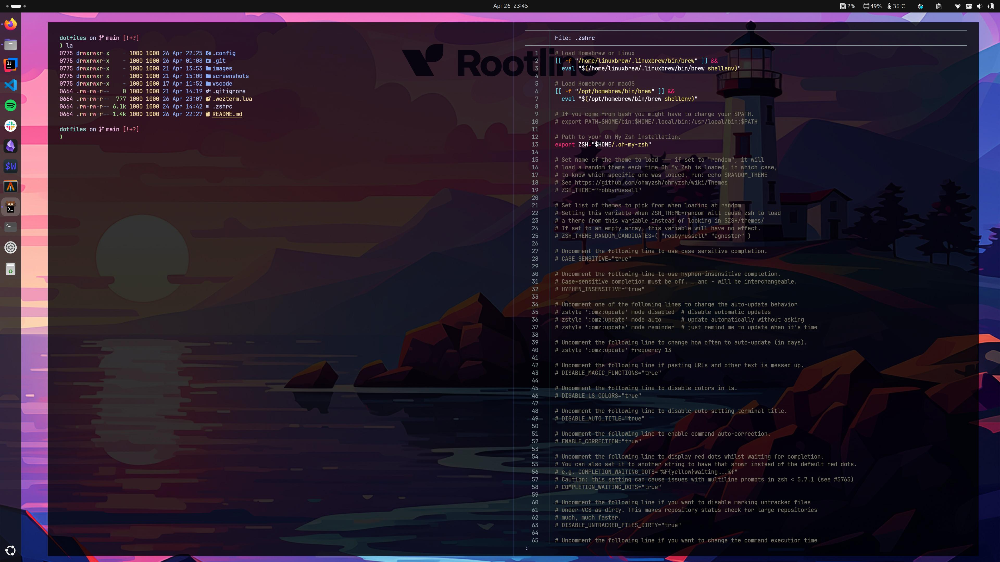
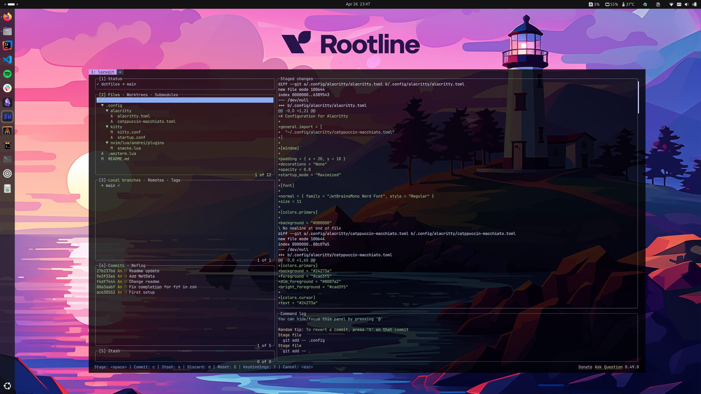
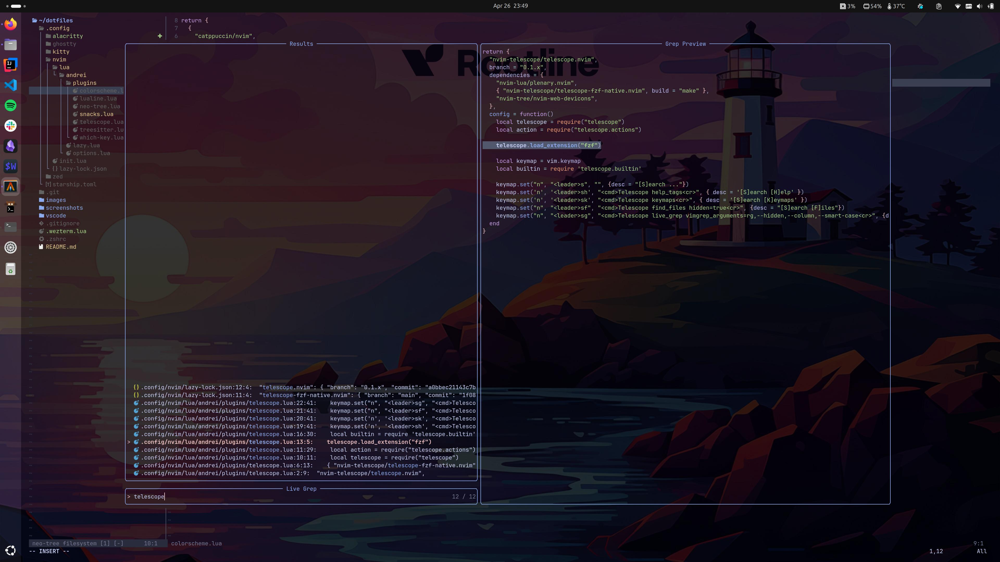

# Config Readme

## Tools to install

```bash
# Starship 
brew install starship
# fzf 
brew install fzf
# eza 
brew install eza
# ripgrep 
brew install ripgrep
# lazygit 
brew install lazygit
```

#### Fonts
- [Nerd Font](https://www.nerdfonts.com/font-downloads) from where to pick a font with icons like JetBrains, FiraCode or Hack.
- [JetBrains Mono Font](https://www.jetbrains.com/lp/mono/) from where to get a font without icons.

#### System monitoring
- [NetData](https://github.com/netdata/netdata)

#### Alternative terminals
- [Kitty](https://sw.kovidgoyal.net/kitty/binary/#) (Python)
- [WezTerm](https://wezterm.org/) (Rust)
- [Alacritty](https://alacritty.org/) (Rust)
- [Ghostty](https://ghostty.org/download) (Zig)

## Oh-my-zsh
```bash
sh -c "$(curl -fsSL https://raw.githubusercontent.com/ohmyzsh/ohmyzsh/master/tools/install.sh)"
rm ~/.zshrc
```

## Create symbolic links
```bash
ln -s ~/dotfiles/.zshrc ~/.zshrc
ln -s ~/dotfiles/.config/nvim ~/.config/nvim
ln -s ~/dotfiles/.config/starship.toml ~/.config/starship.toml
ln -s ~/dotfiles/vscode/settings.json ~/.config/Code/User/settings.json
ln -s ~/dotfiles/.wezterm.lua ~/.wezterm.lua
ln -s ~/dotfiles/.config/alacritty ~/.config/alacritty
ln -s ~/dotfiles/.config/ghostty ~/.config/ghostty
ln -s ~/dotfiles/.config/kitty ~/.config/kitty
```

## Set zsh as default shell
`chsh -s $(which zsh)`

# Tips

# Screenshots




