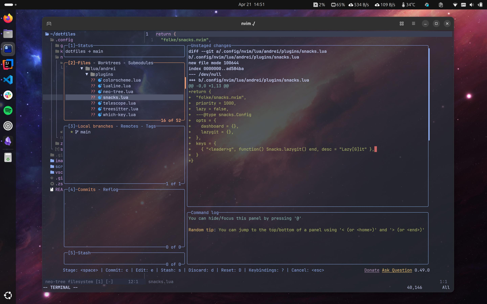
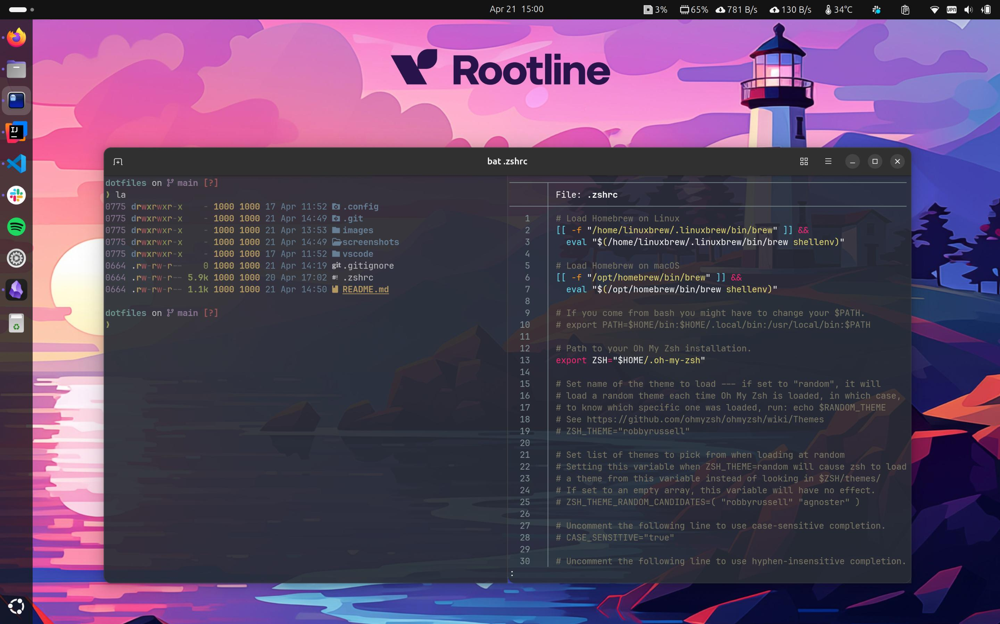

# Config Readme

## Tools to install

```bash
# Starship 
brew install starship
# fzf 
brew install fzf
# eza 
brew install eza
# ripgrep 
brew install ripgrep
# lazygit 
brew install lazygit
```
- Install [Ghostty](https://ghostty.org/download) terminal
- Or install [Kitty](https://sw.kovidgoyal.net/kitty/binary/#) terminal
- Install a [Nerd Font](https://www.nerdfonts.com/font-downloads) (like JetBrains, FiraCode or Hack)
- Install [NetData](https://github.com/netdata/netdata) to monitor your system


## Oh-my-zsh
```
sh -c "$(curl -fsSL https://raw.githubusercontent.com/ohmyzsh/ohmyzsh/master/tools/install.sh)"
rm ~/.zshrc
```

## Create symbolic links

    ln -s ~/dotfiles/.zshrc ~/.zshrc
    ln -s ~/dotfiles/.config/nvim ~/.config/nvim
    ln -s ~/dotfiles/.config/ghostty ~/.config/ghostty
    ln -s ~/dotfiles/vscode/settings.json ~/.config/Code/User/settings.json
    ln -s ~/dotfiles/.config/starship.toml ~/.config/starship.toml
    ln -s ~/dotfiles/.config/kitty ./kitty

## Set zsh as default shell
`chsh -s $(which zsh)`

# Tips

# Screenshots



