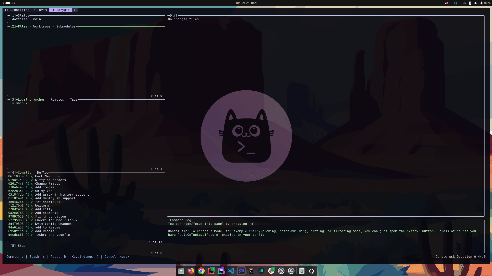
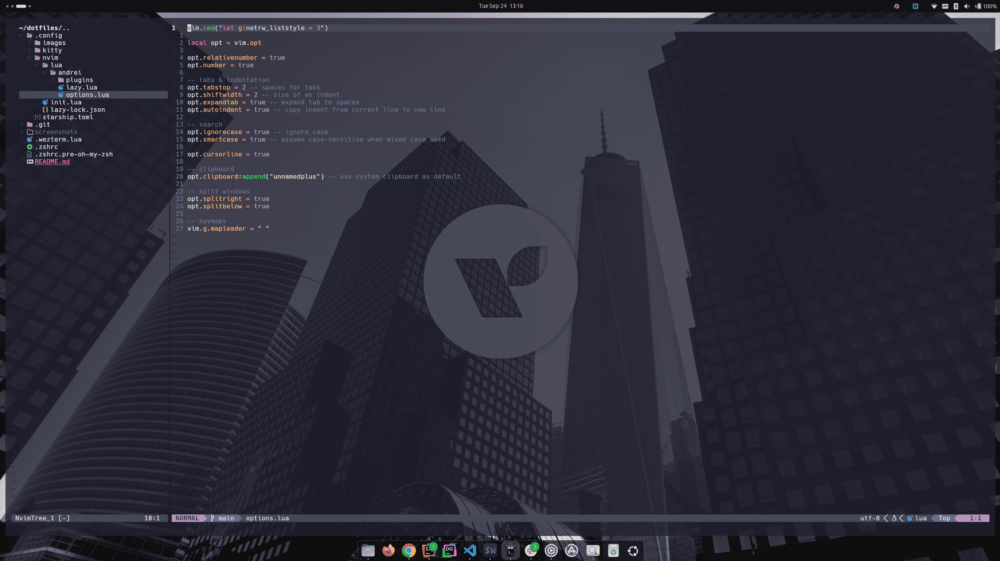

# Config Readme

## Tools to install

- Lazygit `brew install lazygit`
- Starship `brew install starship`
- fzf `brew install fzf`
- Install [Wezterm](https://wezfurlong.org/wezterm/installation.html)
- Install [Kitty](https://sw.kovidgoyal.net/kitty/binary/#)
- Install [Hack Nerd Font](https://www.nerdfonts.com/font-downloads)

## Oh-my-zsh
```
sh -c "$(curl -fsSL https://raw.githubusercontent.com/ohmyzsh/ohmyzsh/master/tools/install.sh)"
rm ~/.zshrc
```

## Create symbolic links

    ln -s ~/dotfiles/.zshrc ~/.zshrc
    ln -s ~/dotfiles/.config/nvim ~/.config/nvim
    ln -s ~/dotfiles/.config/starship.toml ~/.config/starship.toml
    ln -s ~/dotfiles/.config/kitty ./kitty
    ln -s ~/dotfiles/.config/images ~/.config/images
    ln -s ~/dotfiles/.wezterm.lua ~/.wezterm.lua

## Set zsh as default shell
`chsh -s $(which zsh)`

# Screenshots


